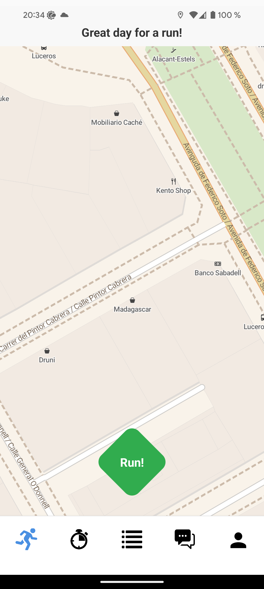
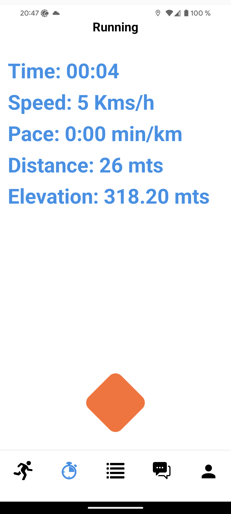
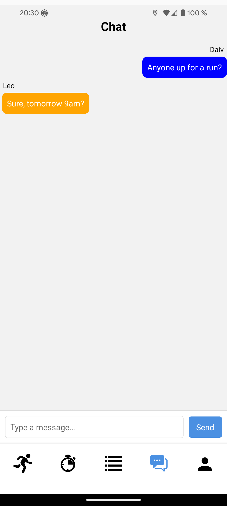
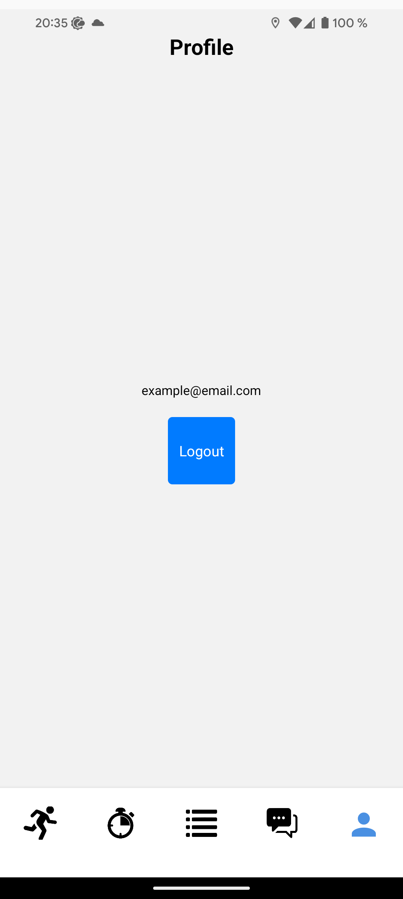

# PackRun

An application for **tracking running routes** and **facilitating communication** between runners via in-app chat.

---

## Demo & Screenshots

[Watch demo](https://youtu.be/CFTHtGVFQRM)

<p style="display: flex; ">
  
  
  
</p>
<p style="display: flex; justify-content:center;">
  
  
</p>

---

## Getting Started

Follow these steps to set up and run the project from your console.

### Server Setup

First, navigate to the `server` directory.

1.  **Install dependencies:**

    ```bash
    npm install
    ```

2.  **Create an environment file:**

    Create a file named **.env** in the `server` directory and add the following environment variables.

    * `GEOAPIFY_API_KEY`: An API key for map information. Get yours by creating an account on [GeoApify](https://www.geoapify.com/).
    * `STADIA_MAPS_API_KEY`: An API key for retrieving map tiles. Get yours by creating an account on [Stadia Maps](https://stadiamaps.com/).
    * `COGNITO_USER_POOL_ID`: The ID for your Amazon Cognito User Pool.
        * **Process:**
            * Create an account on Amazon Web Services (AWS) at [AWS](https://aws.amazon.com).
            * In the AWS console, navigate to the **Cognito** service.
            * Under **User Pools**, click **Create user pool** and follow the configuration steps.
            * After creation, you'll find the User Pool ID on the pool's overview page (e.g., `us-east-1_xxxxxxxxx`).
    * `COGNITO_CLIENT_ID`: The client ID for your application in Amazon Cognito.
        * **Process:**
            * Within your Cognito User Pool, go to the **App clients** tab.
            * Click **Create app client**.
            * Give the client a name and configure the options as needed.
            * Once created, you will be provided with an App client ID. This is your `COGNITO_CLIENT_ID`.
    * `DB_USER_NAME`: The name of a PostgreSQL user with no privileges.
    * `DB_USER_PASSWORD`: The password for the PostgreSQL user.
    * `DB_NAME`: The name you want for the database.
    * `DB_SUSER_NAME`: The name of a PostgreSQL user with admin privileges.
    * `DB_SUSER_PASSWORD`: The password for the PostgreSQL admin user.

    Your completed `.env` file should look similar to this (with your own keys):

    ```ini
    GEOAPIFY_API_KEY="your_geoapify_key"
    STADIA_MAPS_API_KEY="your_stadia_key"
    DB_USER_NAME="your_db_user_name"
    DB_USER_PASSWORD="your_db_user_password"
    DB_NAME="your_desired_db_name"
    DB_SUSER_NAME="your_db_suser_name"
    DB_SUSER_PASSWORD="your_db_suser_password"
    COGNITO_USER_POOL_ID="your_cognito_user_pool_id"
    COGNITO_CLIENT_ID="your_cognito_client_id"
    ```

    * **Run the server:**

    ```bash
    npm run dev
    ```

### Client Setup

1.  **Install dependencies:**

    ```bash
    npm install
    ```

2.  **Set up a device:**

    You must use a physical device or [create a virtual device](https://reactnative.dev/docs/set-up-your-environment) to run the app.

3.  **Install native libraries:**

    Run the following command the **first time** you run the project.
    * **For Android devices:**
        ```bash
        npm run android
        ```
    * **For iOS devices:**
        ```bash
        npm run ios
        ```

4.  **Run the application:**

    After the libraries are installed in your device, you can start the app with:

    ```bash
    npm run start
    ```

---

## Tech Stack

* **Client:**<br>
    <picture></picture>
    <picture></picture>
    <picture></picture>
    <picture></picture>
    <picture></picture>
    <picture></picture>

* **Server:**<br>
    <picture></picture>
    <picture></picture>
    <picture></picture>
    <picture></picture>
    <picture></picture>
    <picture></picture>
    <picture></picture>
    <picture></picture>
    <picture></picture>

---

## Contributors

* [Archie Maunder-Taylor](https://github.com/vrch1e)
* [Paul Paumier Martinez](https://github.com/nimbus4gh)
* [Rawad Nounou](https://github.com/rawad123321)
* [Vera Kijewski](https://github.com/zwergpirate)